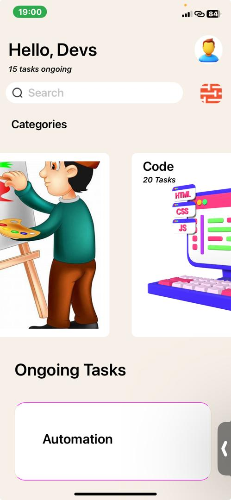

* The Greetings components display the introduction to the page which has the "Hello Devs " greeting and a profile photo image.

#

* SearchBox component provides an input field where the user can interact with the app by typing in the search box provided. It also displays a search icon and a shuffle icon as well. 
#

* Categories component renders a list of horizontal photos and has texts which describe the photo and the number of tasks remaining on the photos. This was achieved with the help of FlatList.

#
* The tasks component displays all the current ongoing tasks in the app. 
#

#

